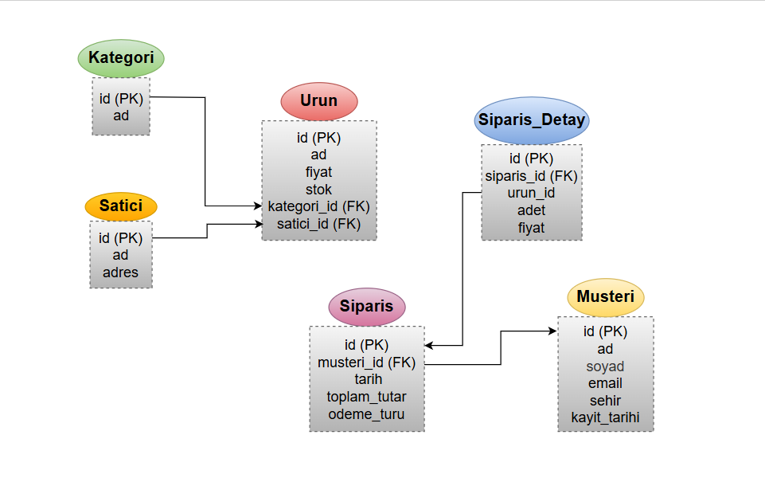
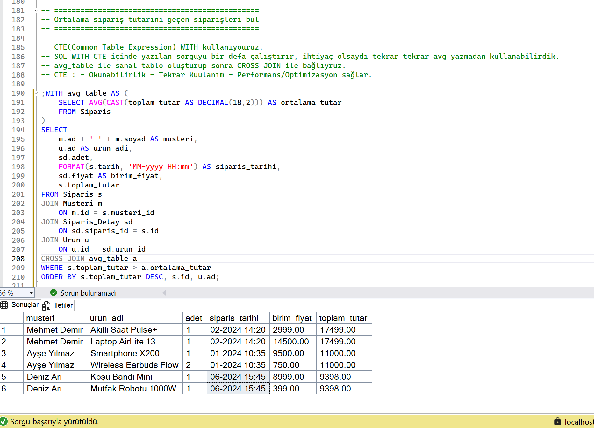
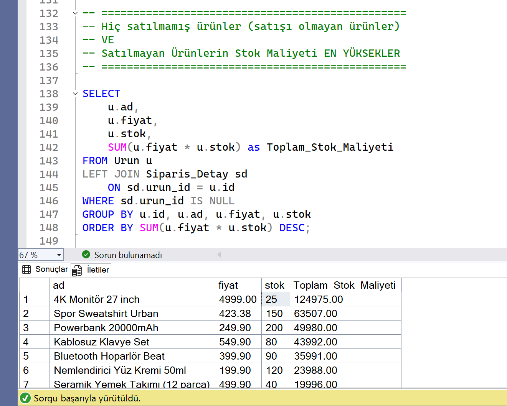

# 🛒 E-Ticaret Veritabanı Projesi

## 📌 Proje Hakkında

Bu projeyi **Techcareer SQL Bootcamp Bitirme Projesi** kapsamında geliştirdim.
Amacım gerçek bir e-ticaret sistemi için **SQL Server** üzerinde veritabanı tasarımı yapmak ve iş zekâsı odaklı raporlama sorguları oluşturmaktır.

---

## 🗄️ Veritabanı Tasarımı ve ER-Diagramı

* **Müşteri → Sipariş** (1:N)
* **Sipariş → Sipariş_Detay** (1:N, ON DELETE CASCADE)
* **Sipariş_Detay → Ürün** (N:1)
* **Ürün → Satıcı** (N:1)
* **Ürün → Kategori** (N:1)

> Tasarım sırasında **ilişkiler**, **foreign key’ler** ve **ON DELETE CASCADE** kullanımı ile bütünlük korunmuştur.

---

## 🔍 İş Problemlerine Yönelik Sorgular

### 1. En çok sipariş veren 5 müşteri

### 2. En çok satılan ürünler

### 3. En yüksek cirosu olan satıcılar

### 4. Şehirlere göre müşteri sayısı

### 5. Kategori bazlı toplam satışlar (cirolar)

### 6. Aylara göre sipariş sayısı

### 7. Siparişlerde müşteri + ürün + satıcı bilgisi

### 8. Hiç satılmamış ürünler ve stok maliyetleri

### 9. Hiç sipariş vermemiş müşteriler

### 10. En çok kazanç sağlayan ilk 3 kategori

### 11. Ortalama sipariş tutarını geçen siparişler

### 12. En az bir kez elektronik ürün satın alan müşteriler

---

## 📊 Örnek Senaryolar

Aşağıda bazı raporların görselleştirilmiş çıktıları yer almaktadır:

## Ortalama sipariş tutarını geçen siparişler:
 
  

## Satılmayan ürünlerin stok maliyeti:

  

---

## ⚙️ Neler Yaptım?

* **CTE (WITH)** kullanarak karmaşık sorguların okunabilirliğini artırdım.
* **JOIN** yapıları ile müşteri, sipariş, ürün ve satıcı tablolarını ilişkilendirdim.
* **Aggregate (SUM, COUNT, AVG)** fonksiyonları ile özet raporlar hazırladım.
* **FORMAT()** fonksiyonu ile tarihleri yıl/ay/saat/dakika bazında raporladım.
* **ON DELETE CASCADE** ile ilişkisel bütünlüğü korudum.
* Performans için bazı alanlarda **index**’ler oluşturdum.

---

